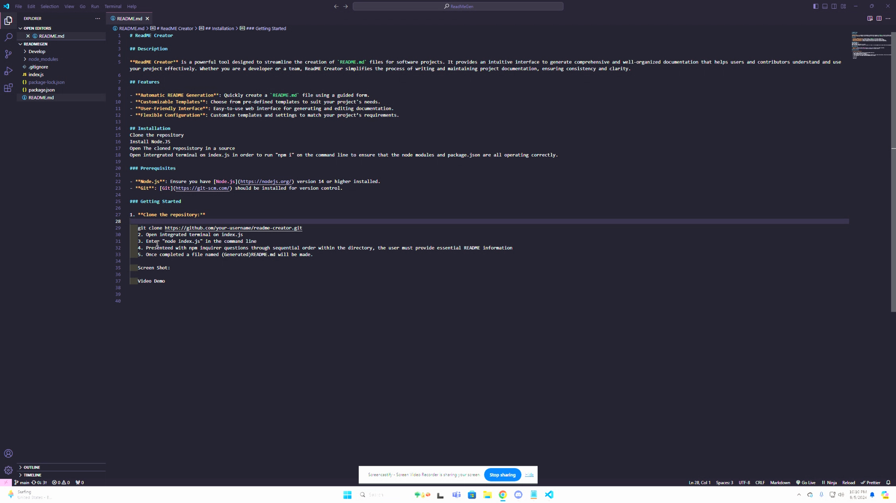

# ReadME Creator

## Description

**ReadME Creator** is a powerful tool designed to streamline the creation of `README.md` files for software projects. It provides an intuitive interface to generate comprehensive and well-organized documentation that helps users and contributors understand and use your project effectively. Whether you are a developer or a team, ReadME Creator simplifies the process of writing and maintaining project documentation, ensuring consistency and clarity.

## Features

- **Automatic README Generation**: Quickly create a `README.md` file using a guided form.
- **Customizable Templates**: Choose from pre-defined templates to suit your project's needs.
- **User-Friendly Interface**: Easy-to-use web interface for generating and editing documentation.
- **Flexible Configuration**: Customize templates and settings to match your project’s requirements.

## Installation
Clone the repository
Install Node.JS
Open The cloned reposistory in a source
Open intergrated terminal on index.js in order to run "npm i" on the command line to ensure that the node modules and package.json are all operating correctly. 

### Prerequisites

- **Node.js**: Ensure you have [Node.js](https://nodejs.org/) version 14 or higher installed.
- **Git**: [Git](https://git-scm.com/) should be installed for version control.

### Getting Started

1. **Clone the repository:**

   git clone https://github.com/Ksjames22/ReadMeGen.git
   2. Open integrated terminal on index.js
   3. Enter "node index.js" in the command line
   4. Presenteed with npm inquirer questions through sequential order within the directory, the user must provide essential README information
   5. Once completed a file named (Generated)README.md will be made. 

   Screen Shot: 

   Video Demo
   
   https://drive.google.com/file/d/1wQKZCR4Oc1cWeQon4auj64HdlW7x5EW5/view?usp=sharing

## Questions
For any questions, please contact me on [GitHub](https://github.com/Ksjames22) or email me at ksjames@radford.edu.
